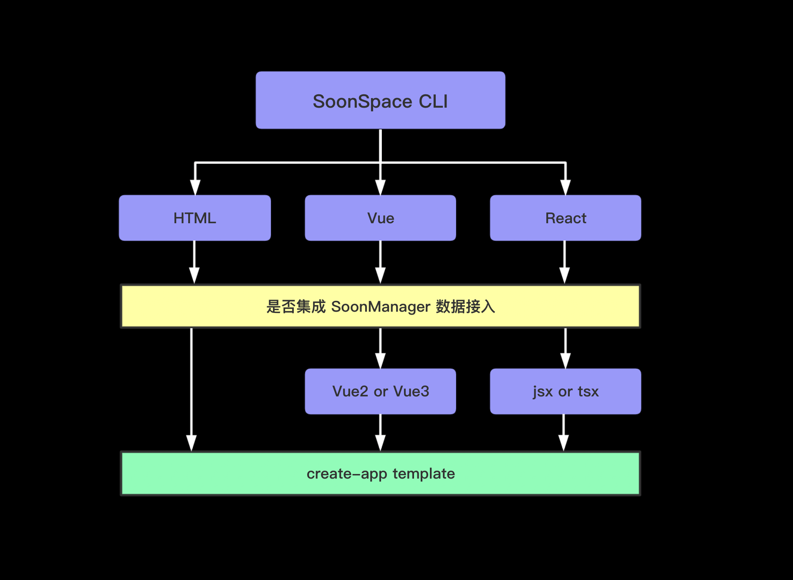

# 快速上手

## hello-world

## 快速搭建

使用 `@soonspacejs/create-app` 快速搭建项目。你可以选择 `Vue`、`React`或者是 `Html` 其中任一开发环境，并且提供是否自动集成 [soonmanager-sync](../plugin/soonmanager-sync.html) 配置选项。

```sh
# 通过以下命令搭建一个项目模板
npx @soonspacejs/create-app your-pro-name
```

`@soonspacejs/create-app` 的简要架构:



::: tip SoonSpace CLI 能力
`SoonSpace CLI` 是基于 `Vue CLI` 和 `create-react-app` 提供一些固定环境的初始项目模版，模版的构建时可配置性如上图所示，比较简单。构建后的可配置性不受 `SoonSpace CLI` 约束，完全取决于各自 `CLI` 框架模版的能力。
<br>

Vue CLI：[https://cli.vuejs.org/zh/](https://cli.vuejs.org/zh/)
<br>
create-react-app：[https://create-react-app.dev/](https://create-react-app.dev/)
<br>

如果你想在构建时便集成搭建各自框架的周边生态，例如（DvaJS、UmiJS），这时 `SoonSpace CLI` 是无法做到了。推荐使用下方 **手动搭建** 的方式，将 `soonspacejs` 集成到现有项目环境中。
:::

## 手动搭建

#### node

```bash
# 安装
npm install soonspacejs -S
# 或者
yarn add soonspacejs -S
```

#### CDN

[https://unpkg.com/soonspacejs/dist/index.js](https://unpkg.com/soonspacejs/dist/index.js)

### 在 html 中使用

```html
<!DOCTYPE html>
<html lang="en">
  <head>
    <meta charset="UTF-8" />
    <meta name="viewport" content="width=device-width, initial-scale=1.0" />
    <meta http-equiv="X-UA-Compatible" content="ie=edge" />
    <title>SoonSpace Example</title>
  </head>

  <body>
    <div id="view"></div>

    <script src="https://unpkg.com/soonspacejs/dist/index.js"></script>
    <script>
      const ssp = new SoonSpace({
        // 绑定场景的元素选择器
        el: '#view',
        // 初始配置项
        options: {
          // 是否显示网格
          showGrid: true,
        },
        // 场景交互事件
        events: {
          // 模型点击
          modelClick({ target, currentTarget }) {
            console.log(target, currentTarget);
          },
        },
      });
    </script>
  </body>
</html>
```

### 在 Vue 中使用

[vue-soonspace](../plugin/vue-soonspace.html)

### 在 React 中使用

[react-soonspace](../plugin/react-soonspace.html)
